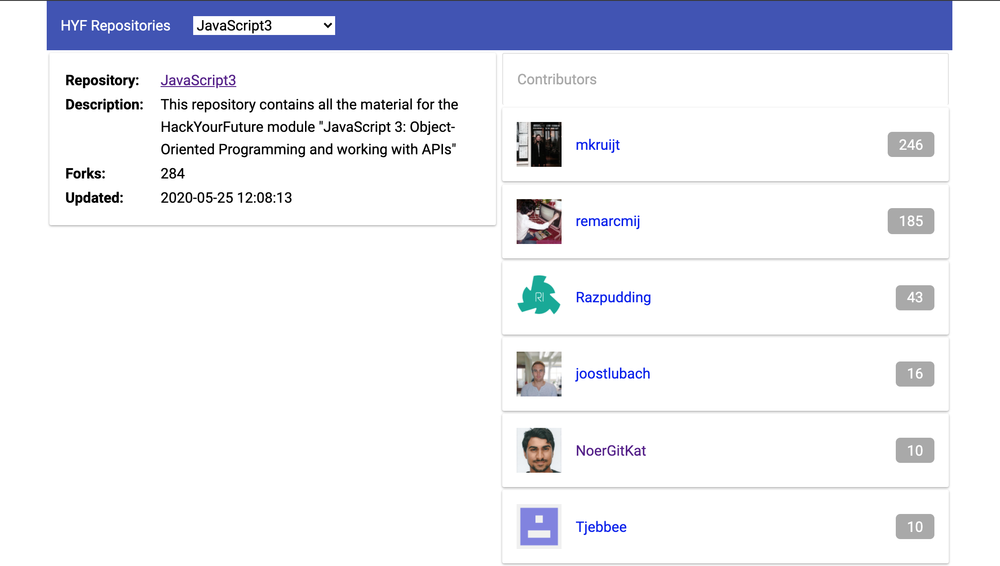

# Homework JavaScript3 Week 1

## **Todo list**

1. Practice the concepts
2. JavaScript exercises
3. Code along
4. PROJECT: Hack Your Repo I

## **1. Practice the concepts**

This week's concepts can be challenging, therefore let's get an easy introduction using some interactive exercises! Check the following resources out and start practicing:

- [Learn JavaScript: Requests](https://www.codecademy.com/learn/introduction-to-javascript/modules/intermediate-javascript-requests)

## **2. JavaScript exercises**

> Inside of your `JavaScript3` fork and inside of the `Week1` folder, create a folder called `homework`. Inside of that folder, create a folder called `js-exercises`. For all the following exercises create a new `.js` file in that folder (3 files in total). Make sure the name of each file reflects its content: for example, the filename for exercise one could be `getRandomUser.js`.

**Exercise 1: Who do we have here?**

Wouldn't it cool to make a new friend with just the click of a button?

Write a function that makes a HTTP Request to `https://www.randomuser.me/api`

- Inside the JavaScript file write two functions: one with `XMLHttpRequest`, and the other with `axios`
- Each function should make a HTTP Request to the given endpoint: `https://www.randomuser.me/api`
- Log the received data to the console
- Incorporate error handling: log to the console the error message

**Exercise 2: Programmer humor**

Who knew programmers could be funny?

Write a function that makes a HTTP Request to `https://xkcd.now.sh/?comic=latest`

- Inside the same file write two programs: one with `XMLHttpRequest`, and the other with `axios`
- Each function should make a HTTP Request to the given endpoint: `https://xkcd.now.sh/?comic=latest`
- Log the received data to the console
- Render the `img` property into an `` tag in the DOM
- Incorporate error handling: log to the console the error message

**Exercise 3: Dog photo gallery**

Let's make a randomized dog photo gallery!

Write a function that makes a HTTP Request to `https://dog.ceo/api/breeds/image/random`. It should trigger after clicking a button in your webpage. Every time the button is clicked it should append a new dog image to the DOM.

- Create an `index.html` file that will display your random image
- Add 2 `<button>` and 1 `<ul>` element, either in the HTML or through JavaScript
- Write two versions for the button functionality: one with `XMLHttpRequest`, and the other with `axios`
- When any one of the 2 buttons is clicked it should make a HTTP Request to `https://dog.ceo/api/breeds/image/random`
- After receiving the data, append to the `<ul>` a `<li>` that contains an `` element with the dog image
- Incorporate error handling: log to the console the error message

## **3. Code along**

Now that you've learned about APIs and how to connect with them, let's apply it in the context of a complete application.

In the following application you'll be making a HTTP Request to an external, public API. You'll use that data in order to fetch facts that you'll display in your own application: a Numbers Facts application.

Enjoy!

- [Vanilla JS Numbers Facts App - AJAX & Fetch](https://www.youtube.com/watch?v=tUE2Nic21BA)

## **4. PROJECT: Hack Your Repo I**

In the following three weeks you are going to write an application that makes use of the [GitHub API](https://developer.github.com/v3/guides/getting-started/). Each week builds on top of the other, just like a real-world application!

[](https://js3-spa.herokuapp.com/)
Click on the image to open up a demo of the application!

This application, HackYourRepo, does 2 things:

1. It makes connection to the GitHub API and retrieves all the repositories found in the [HackYourFuture account](https://www.github.com/hackyourfuture).
2. It displays those repositories in an alphabetically-ordered list. When a user clicks on any of the repository names it will show more details about it.

In the course of the next 3 weeks you'll be writing the necessary code to make all of this work!

### 4.1 Requirements

To get started, make sure you're in the right GIT branch: `week1-[YOURNAME]`. Then, navigate to the `hackyourrepo-app` folder and become familiar with the files there.

This week you're required to (1) setup the HTML structure of the application. In addition, you are expected to (2) style the application to make it user-friendly.

Here are the requirements for the HTML:

- Include 3 `<section>` tags
- Include a `<select>` tag
- Use the following placeholder data:

```js
const placeholderRepos = [
  {
    name: 'SampleRepo1',
    description: 'This repository is meant to be a sample',
    forks: 5,
    updated: '2020-05-27 12:00:00',
  },
  {
    name: 'AndAnotherOne',
    description: 'Another sample repo! Can you believe it?',
    forks: 9,
    updated: '2020-05-27 12:00:00',
  },
  {
    name: 'HYF-Is-The-Best',
    description:
      "This repository contains all things HackYourFuture. That's because HYF is amazing!!!!",
    forks: 130,
    updated: '2020-05-27 12:00:00',
  },
];
```

Here are the requirements for the CSS:

- Make use of `flexbox`
- Make use of `media-queries` and `calc()` to make the page responsive ([mobile, tablet, desktop](https://tinyurl.com/yc5zmste))

Other than this you can create your own version of the page!

## **SUBMIT YOUR HOMEWORK!**

After you've finished your todo list it's time to show us what you got! The homework that needs to be submitted is the following:

1. JavaScript exercises
2. PROJECT: HackYourRepo I

Upload both to your forked JavaScript3 repository in GitHub. Make a pull request to your teacher's forked repository.

> Forgotten how to upload your homework? Go through the [guide](../hand-in-homework-guide.md) to learn how to do this again.

_Deadline Saturday 23.59 CET_
